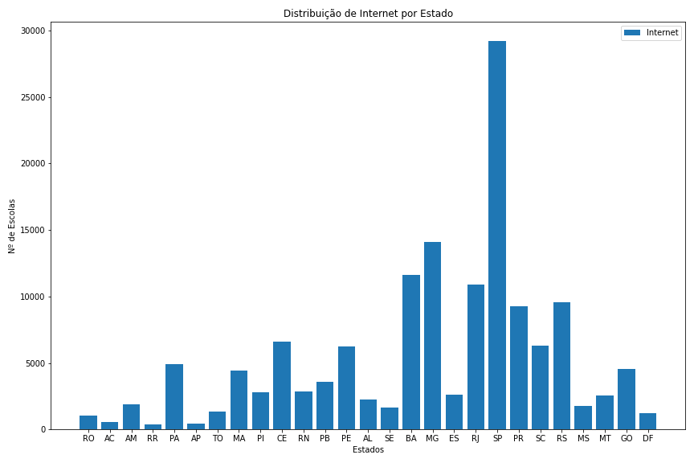
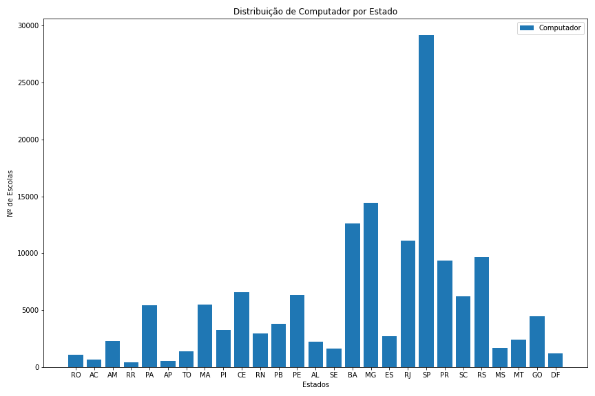
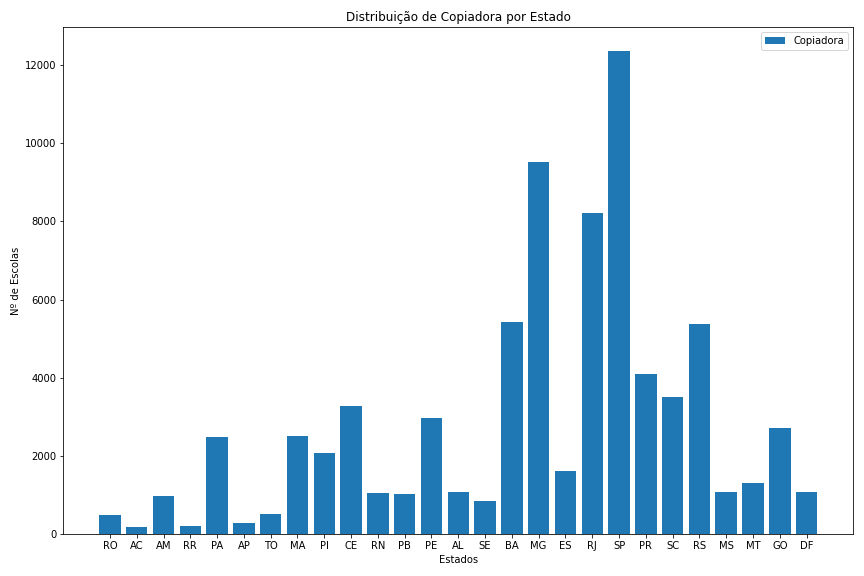
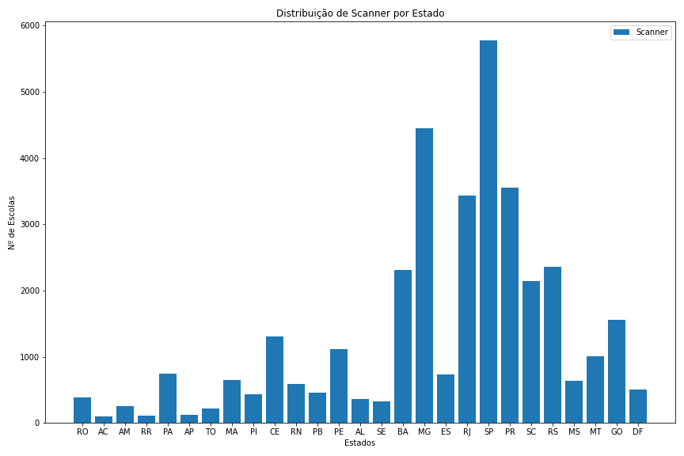
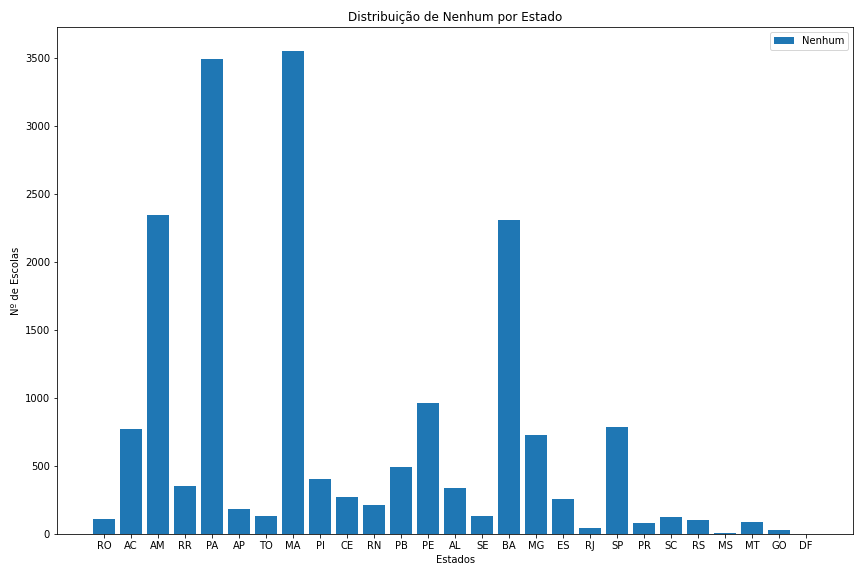
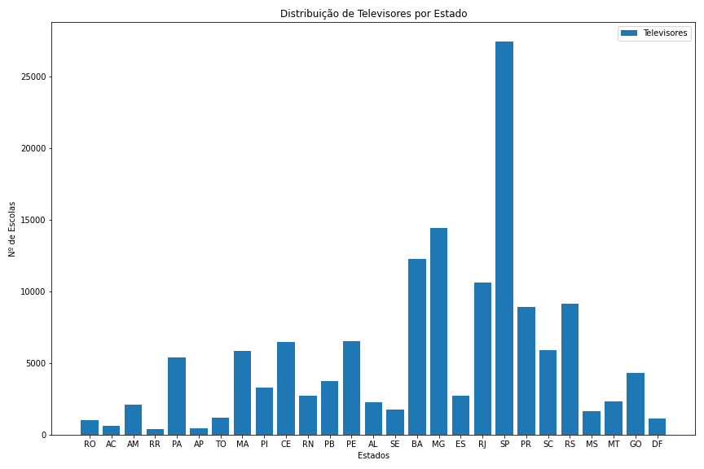

# Distribuição de Equipamento pelos estados brasileiros

Esta análise é feita com base no Censo Escolar de 2020. Nela é vista a disparidade na disponibilidade de equipamentos tecnológicos através do Brasil. Nesta análise, foram pegos os pontos mais principais e representativos dessa diferença que corre pelo Brasil inteiro.

## Internet

## Computador

## Copiadora

## Impressora

## Impressora Multifuncional

## Scanner

## Nenhum

## Televisores

## Lousa Digital

É incrivelmente claro a grande diferença que existe, pois em quase todos os gráficos, São Paulo é campeão em tecnologia, seguido logo por Minas Gerais. Isso se dá não só pelo sudeste brasileiro possuir uma grande quantidade de dinheiro, com seu PIB per capita sendo o maior, mas também pela grande população dos estados, sendo São Paulo a maior cidade da América Latina. 

Algo a se notar é que na distribuição dos lugares que não possuem nenhum equipamento, São Paulo ainda possui margem, mas é rapidamente passado por estados do norte e nordeste