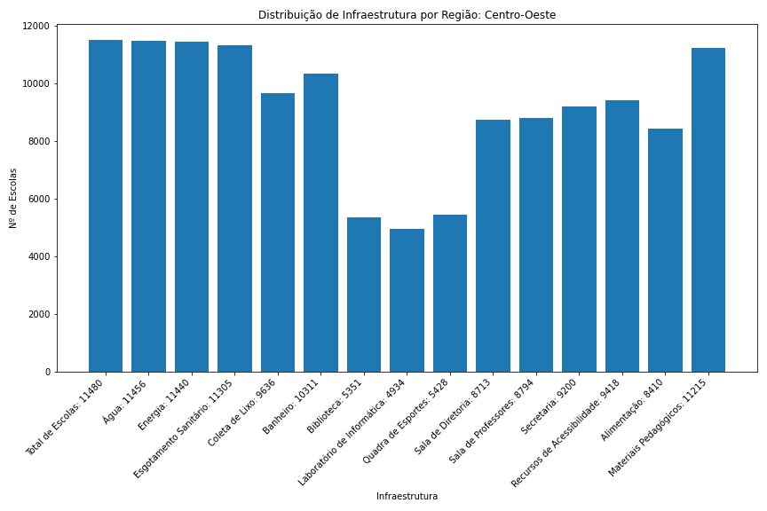
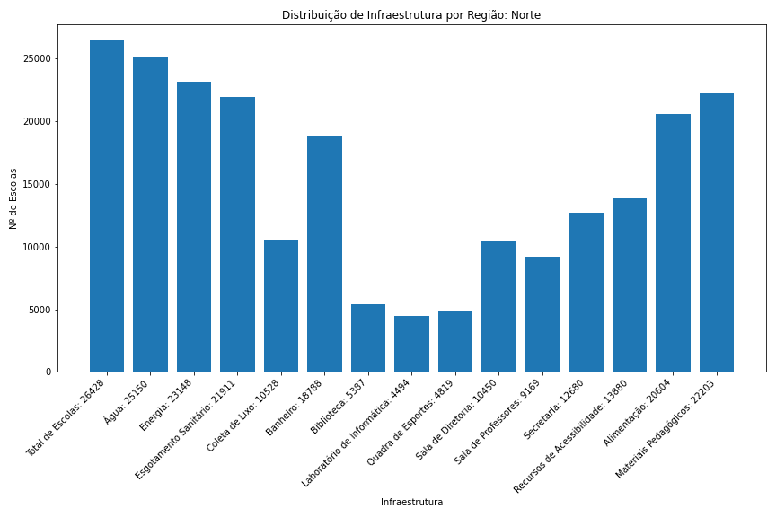
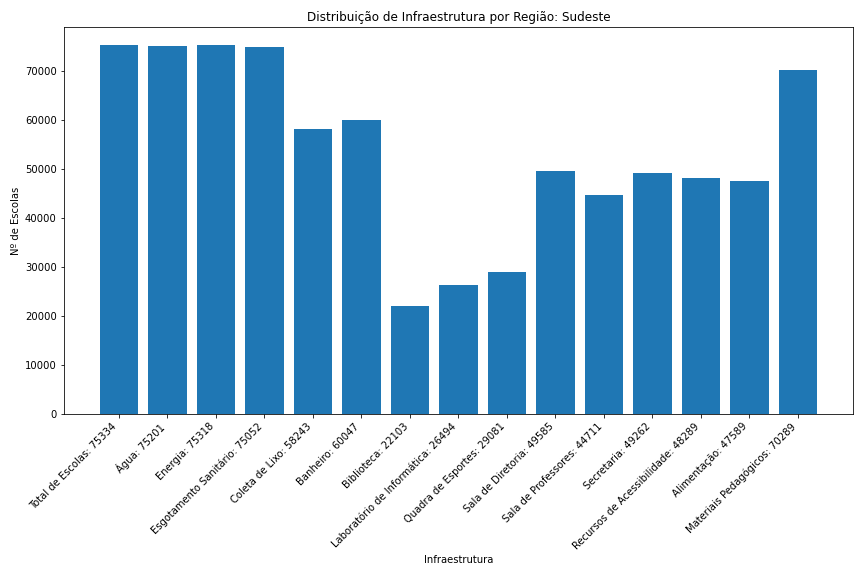
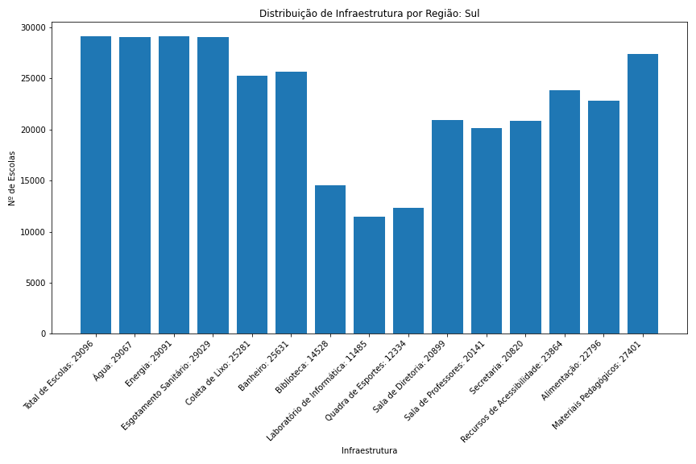

# Infraestrutura das escolas brasileiras: problema regional ou nacional?
A análise a seguir sobre a Infraestrutura das escolas brasileiras é feita tendo como base de dados o Censo Escolar de 2020, realizado pelo Inep e o MEC por todo o Brasil. O conteúdo analisado busca observar se as escolas espalhadas por todo o território brasileiro possuem infraestruturas básicas para o ensino, para o desenvolvimento da criança e do jovem brasileiro (presença de laboratórios de informática, materiais pedagógicos, bibliotecas e etc.), para os funcionários das escolas (presença de secretaria, sala de professores e sala de diretoria), se contém acessibilidade para deficientes (acessibilidade) e se há condições básicas para os cidadãos utilizarem estes colégios (presença de água, alimentação, coleta de lixo  e etc.) 

## Gráfico: Centro-Oeste

## Gráfico: Nordeste

## Gráfico: Norte

## Gráfico: Sudeste

## Gráfico: Sul

De acordo com os gráficos, as duas regiões com melhores infraestruturas em suas escolas são o Sudeste e o Sul do Brasil, logo, pode-se ligar isso ao fato de serem as duas regiões com os maiores PIBs(Produto Interno Bruto) do país, de acordo com o IBGE. O alto investimento em qualidade básica nas escolas dessas duas regiões também está relacioanada ao alto IDH(Índice de Desenvolvimento Humano) que as duas possuem. Porém, alguns recursos muito necessários para as crianças e os jovens não aparecem com alta frequência nesses estados, como bibliotecas e quadras de esportes, aparecendo em apenas aproximadamente 1/3 dos colégios do Sul e Sudeste.

Além disso, a região Centro-Oeste, contendo o segundo pior PIB do país, possui escolas com mais infraestrutura que as escolas nordestinas, mesmo a região Nordeste estando em sua frente no ranking dos PIBs por região do Brasil. Isso pode se dar por conta do crescente desenvolvimento dessa região, com o agronegócio gerando bastante dinheiro para o Centro-Oeste, construindo uma melhora na qualidade de vida do povo centro-oestino.

Por fim, as duas piores regiões em relação a qualidade das escolas, Norte e Nordeste, também são as duas piores em IDH, estudo realizado pela ONU que mede a qualidade de vida da população de tal lugar. Nessas duas regiões, conseguimos analisar a falta de recursos básicos em grandes quantidades de escolas, muito mais se compararmos com as outras três regiões. A falta de energia e coleta de lixo em um número elevadíssimo de escolas reflete a pobreza dessas regiões do Brasil, afetando diretamente a qualidade de vida da população destes lugares.

Logo, conseguimos concluir que, quanto mais alto for o PIB e o IDH de uma determinada região, mais infraestrutura suas escolas terão, esta análise é bastante intuitiva, mas não deixa de ser fundamental de ser observada pelos órgãos públicos, pois conseguirão saber em quais locais deve ter um aumento no investimento na qualidade das escolas.
